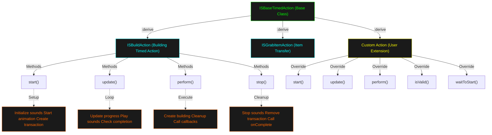

# Custom Build Action Implementation Guide

## Overview

A **Custom Build Action** extends `ISBaseTimedAction` to define specialized building behaviors. It integrates with `ISBuildingObject` to execute server-side when player confirms placement.

---



## Architecture

### Class Hierarchy

```lua
ISBaseTimedAction (base)
  ├── ISBuildAction (standard building)
  └── CustomBuildAction (your extension)
```

### Key Lifecycle

```
ISBuildingObject.tryBuild()
  ├─> Creates ISBuildAction or CustomBuildAction
  ├─> ISTimedActionQueue.add(action)
  └─> Action execution sequence:
      ├─> start()       -- Initialize
      ├─> update()      -- Per-frame loop (optional)
      ├─> perform()     -- Execute on completion
      └─> stop()        -- Cleanup on cancel
```

---

## ISBuildAction Structure

Location: `client/BuildingObjects/TimedActions/ISBuildAction.lua`

### Constructor

```lua
function ISBuildAction:new(character, item, x, y, z, north, spriteName, time)
    local o = {}
    setmetatable(o, self)
    self.__index = self
    o.character = character           -- Player performing action
    o.item = item                     -- Building object
    o.x, o.y, o.z = x, y, z         -- World coordinates
    o.north = north                  -- Direction
    o.spriteName = spriteName        -- Sprite name
    o.maxTime = time                 -- Duration in ticks
    o.square = getCell():getGridSquare(x, y, z)
    o.transactionId = 0              -- Server transaction ID
    return o
end
```

### Core Methods

#### `start()` - Initialization (lines 146-173)

Called when action begins execution.

```lua
function ISBuildAction:start()
    -- Setup animation
    self.item.ghostSprite = IsoSprite.new()
    self.item.ghostSprite:LoadSingleTexture(self.spriteName)

    -- Initialize sounds
    if not self.item.noNeedHammer then
        self.sawSound = 0
        self.hammerSound = 0
    end

    -- Callback before action starts
    self.item:onTimedActionStart(self)

    -- Create server-side transaction (prevents race conditions)
    self.transactionId = createBuildAction(
        self.character,
        self.x, self.y, self.z,
        self.north,
        self.spriteName,
        self.item
    )
end
```

#### `update()` - Per-Frame Loop (lines 92-144)

Called every frame while action runs.

```lua
function ISBuildAction:update()
    -- Play work sounds periodically
    if self.soundTime + ISBuildAction.soundDelay < getTimestamp() then
        self.soundTime = getTimestamp()

        -- Play hammer or saw sound
        if not self.doSaw then
            self.hammerSound = self.character:getEmitter():playSound("Hammering")
            self.doSaw = true
        else
            self.sawSound = self.character:getEmitter():playSound("Sawing")
            self.doSaw = false
        end
    end

    -- Set metabolic impact
    self.character:setMetabolicTarget(Metabolics.HeavyWork)

    -- Keep facing the build location
    self:faceLocation()

    -- Check for server completion
    if isClient() and isActionDone(self.transactionId) then
        self:forceComplete()
    end
end
```

#### `perform()` - Completion (lines 220-264)

Called when action finishes. **Server-only logic here**.

```lua
function ISBuildAction:perform()
    removeAction(self.transactionId, false)

    -- Cleanup
    self.item.ghostSprite = nil
    self.character:getEmitter():stopSound(self.hammerSound)

    -- Server-side: Create the actual object
    if not isClient() then
        self.item.character = self.character
        self.item:create(self.x, self.y, self.z, self.north, self.spriteName)
        self.square:RecalcAllWithNeighbours(true)
        buildUtil.setHaveConstruction(self.square, true)
    end

    -- Mark action complete
    ISBaseTimedAction.perform(self)

    -- Callbacks
    if self.onCompleteFunc then
        self.onCompleteFunc(self.onCompleteTarget)
    end
end
```

#### `stop()` - Cancellation (lines 175-193)

Called if action is interrupted.

```lua
function ISBuildAction:stop()
    self.item:onTimedActionStop(self)
    self.item.ghostSprite = nil

    -- Stop audio
    if self.sawSound ~= 0 then
        self.character:getEmitter():stopSound(self.sawSound)
    end
    if self.hammerSound ~= 0 then
        self.character:getEmitter():stopSound(self.hammerSound)
    end

    -- Cancel server transaction
    removeAction(self.transactionId, true)

    -- Parent cleanup
    ISBaseTimedAction.stop(self)

    -- Call completion callbacks
    if self.onCompleteFunc then
        self.onCompleteFunc(self.onCompleteTarget)
    end
end
```

#### `isValid()` - Validation (lines 38-54)

Checks if action can proceed.

```lua
function ISBuildAction:isValid()
    local valid = true

    -- Check hammer condition
    if not self.item.noNeedHammer and self.hammer then
        valid = self.hammer:getCondition() > 0
    end

    -- Call custom validation if defined
    if self.onIsValid then
        local facing = self.item:getFace():getFaceName()
        local params = { square = self.square, facing = facing }
        if not BaseCraftingLogic.callLuaBool(self.onIsValid, params) then
            valid = false
        end
    end

    return valid
end
```

#### `waitToStart()` - Pre-Start Wait (lines 76-80)

Optional delay before starting (e.g., character turning).

```lua
function ISBuildAction:waitToStart()
    if ISBuildMenu.cheat then return false end
    self:faceLocation()
    return self.character:shouldBeTurning()  -- Wait if turning
end
```

---

## Creating Custom Build Actions

### Example 1: Painting Action (Hammer-Free Build)

```lua
require "TimedActions/ISBaseTimedAction"

ISCustomPaintAction = ISBaseTimedAction:derive("ISCustomPaintAction")

function ISCustomPaintAction:start()
    -- Custom animation for painting
    self:setActionAnim("Paint")

    -- No hammer needed, no saw/hammer sounds
    self.soundTime = 0

    -- Setup visual feedback
    self.item.ghostSprite = IsoSprite.new()
    self.item.ghostSprite:LoadSingleTexture(self.spriteName)
    self.item.ghostSpriteX = self.x
    self.item.ghostSpriteY = self.y

    self.item:onTimedActionStart(self)

    -- Lightweight server transaction
    self.transactionId = createBuildAction(
        self.character, self.x, self.y, self.z,
        self.north, self.spriteName, self.item
    )
end

function ISCustomPaintAction:update()
    -- Paint-specific sound (less intense than hammering)
    if self.soundTime + 8 < getTimestamp() then
        self.soundTime = getTimestamp()
        self.character:getEmitter():playSound("Painting")
    end

    self.character:setMetabolicTarget(Metabolics.LightWork)
    self:faceLocation()

    if isClient() and isActionDone(self.transactionId) then
        self:forceComplete()
    end
end

function ISCustomPaintAction:perform()
    removeAction(self.transactionId, false)
    self.item.ghostSprite = nil
    self.character:getEmitter():stopSound(self.paintSound)

    if not isClient() then
        -- Custom paint logic before creation
        if self.item.paintColor then
            -- Apply color data
        end

        self.item.character = self.character
        self.item:create(self.x, self.y, self.z, self.north, self.spriteName)
        self.square:RecalcAllWithNeighbours(true)
    end

    ISBaseTimedAction.perform(self)

    if self.onCompleteFunc then
        self.onCompleteFunc(self.onCompleteTarget)
    end
end

function ISCustomPaintAction:isValid()
    -- Check paint item available
    local paintItem = self.character:getInventory():getFirstTagEvalRecurse(ItemTag.PAINT)
    return paintItem ~= nil
end

function ISCustomPaintAction:new(character, item, x, y, z, north, spriteName, time)
    local o = {}
    setmetatable(o, self)
    self.__index = self
    o.character = character
    o.item = item
    o.x, o.y, o.z = x, y, z
    o.north = north
    o.spriteName = spriteName
    o.maxTime = time
    o.square = getCell():getGridSquare(x, y, z)
    o.transactionId = 0
    o.soundTime = 0
    o.paintSound = 0
    if isClient() then
        o.maxTime = -1
    end
    return o
end
```

### Example 2: Multi-Step Action (Plant Assembly)

```lua
ISAssemblyAction = ISBaseTimedAction:derive("ISAssemblyAction")

function ISAssemblyAction:start()
    self:setActionAnim("Craft")
    self.currentStep = 0
    self.totalSteps = 5  -- 5-step assembly process

    self.item:onTimedActionStart(self)
    self.transactionId = createBuildAction(
        self.character, self.x, self.y, self.z,
        self.north, self.spriteName, self.item
    )
end

function ISAssemblyAction:update()
    -- Progress step every 2 seconds (120 ticks)
    if self.currentStep < self.totalSteps then
        local progress = self:getJobDelta()
        local nextStep = math.ceil(progress * self.totalSteps)

        if nextStep > self.currentStep then
            self.currentStep = nextStep
            self.character:getEmitter():playSound("Assembling")
            print("Assembly step " .. self.currentStep .. " / " .. self.totalSteps)
        end
    end

    self.character:setMetabolicTarget(Metabolics.HeavyWork)
    self:faceLocation()

    if isClient() and isActionDone(self.transactionId) then
        self:forceComplete()
    end
end

function ISAssemblyAction:perform()
    removeAction(self.transactionId, false)

    if not isClient() then
        -- Assembly-specific creation
        local object = self.item:create(self.x, self.y, self.z, self.north, self.spriteName)

        -- Add assembly state metadata
        if object then
            object:getModData().assemblySteps = self.totalSteps
            object:getModData().fullyAssembled = true
        end

        self.square:RecalcAllWithNeighbours(true)
    end

    ISBaseTimedAction.perform(self)

    if self.onCompleteFunc then
        self.onCompleteFunc(self.onCompleteTarget)
    end
end

function ISAssemblyAction:new(character, item, x, y, z, north, spriteName, time)
    local o = {}
    setmetatable(o, self)
    self.__index = self
    o.character = character
    o.item = item
    o.x, o.y, o.z = x, y, z
    o.north = north
    o.spriteName = spriteName
    o.maxTime = time
    o.square = getCell():getGridSquare(x, y, z)
    o.transactionId = 0
    o.currentStep = 0
    o.totalSteps = 5
    if isClient() then
        o.maxTime = -1
    end
    return o
end
```

---

## Integration with ISBuildingObject

### In Your Building Object:

```lua
require "ISBaseObject"

ISCustomBuilding = ISBaseObject:derive("ISCustomBuilding")

function ISCustomBuilding:initialise()
    -- Define action class
    self.customActionClass = ISCustomPaintAction

    -- Optional: Set action duration (ms per item)
    self.maxTime = 150  -- 3 seconds (150 ticks × 20ms)

    -- For no-hammer buildings:
    self.noNeedHammer = true

    -- For animations:
    self.craftingBank = "Painting"  -- Sound bank

    -- Set up completion callback
    self.onActionComplete = self.onBuildComplete
end

function ISCustomBuilding:tryBuild(x, y, z)
    local square = getCell():getGridSquare(x, y, z)
    local playerObj = getSpecificPlayer(self.player)

    if not self.skipBuildAction then
        local maxTime = self.maxTime or 200

        local selfCopy = copyTable(self)
        setmetatable(selfCopy, getmetatable(self, true))

        -- Use custom action instead of ISBuildAction
        local buildAction = self.customActionClass:new(
            playerObj, selfCopy, x, y, z,
            self.north, self:getSprite(), maxTime
        )
    end

    if ISBuildMenu.cheat or self:walkTo(x, y, z) then
        if self.dragNilAfterPlace then
            getCell():setDrag(nil, self.player)
        end

        if not self.skipBuildAction then
            ISTimedActionQueue.add(buildAction)
        else
            self:create(x, y, z, self.north, self:getSprite())
            self:onActionComplete()
        end
    end
end

function ISCustomBuilding:onBuildComplete()
    print("Custom building complete!")
end

function ISCustomBuilding:create(x, y, z, north, sprite)
    local cell = getWorld():getCell()
    self.sq = cell:getGridSquare(x, y, z)

    -- Create the actual Java object
    self.javaObject = IsoThumpable.new(cell, self.sq, sprite, north, self)

    -- Setup properties
    buildUtil.setInfo(self.javaObject, self)
    self.javaObject:setMaxHealth(100)
    self.javaObject:setHealth(100)

    -- Add to world
    self.sq:AddSpecialObject(self.javaObject, self:getObjectIndex())
    self.sq:RecalcAllWithNeighbours(true)

    -- Sync to clients
    self.javaObject:transmitCompleteItemToClients()
end
```

---

## Client vs Server Logic

### Client-Side (`isClient() == true`)

- Animation & UI updates
- Preview rendering
- Input handling
- **Cannot modify game state**

### Server-Side (`isClient() == false`)

- Actual object creation (`item:create()`)
- Inventory operations
- Health/condition changes
- **Modifies authoritative game state**

### Pattern:

```lua
function ISBuildAction:perform()
    if isClient() then
        -- Client just animates completion
        ISBaseTimedAction.perform(self)
        return
    end

    -- Server does actual work
    self.item:create(self.x, self.y, self.z, self.north, self.spriteName)
    self.square:RecalcAllWithNeighbours(true)

    ISBaseTimedAction.perform(self)
end
```

---

## Common Patterns

### Adding Item Requirements

```lua
function ISCustomAction:isValid()
    if not ISBaseTimedAction.isValid(self) then return false end

    local inv = self.character:getInventory()
    local tools = inv:getItemsFromType("Hammer")

    if #tools == 0 then
        return false  -- Action invalid without tools
    end

    return true
end
```

### Custom Validation via Callback

```lua
-- In your building object
self.onIsValid = function(params)
    local square = params.square
    local facing = params.facing

    -- Check custom conditions
    return square:isOutside() and not square:isCovered()
end

-- In action's isValid()
if self.onIsValid then
    if not BaseCraftingLogic.callLuaBool(self.onIsValid, {square = self.square}) then
        return false
    end
end
```

### Progress Feedback

```lua
function ISCustomAction:update()
    local progress = self:getJobDelta()  -- 0.0 to 1.0

    if progress > 0.25 and not self.step1 then
        self.step1 = true
        print("25% complete")
    end
    if progress > 0.75 and not self.step2 then
        self.step2 = true
        print("75% complete")
    end
end
```

### Cleanup on Cancel

```lua
function ISCustomAction:stop()
    -- Cleanup resources
    if self.tempObject then
        self.tempObject:destroy()
    end

    -- Parent cleanup
    ISBaseTimedAction.stop(self)
end
```

---

## Reference: Action Properties

| Property        | Type              | Purpose                     |
| --------------- | ----------------- | --------------------------- |
| `character`     | Character         | Player performing action    |
| `item`          | ISBuildingObject  | Building blueprint          |
| `x, y, z`       | int               | Placement coordinates       |
| `north`         | bool              | Cardinal direction          |
| `spriteName`    | string            | Building sprite name        |
| `maxTime`       | int               | Duration (ticks, 20ms each) |
| `square`        | GridSquare        | Target square               |
| `transactionId` | int               | Server transaction handle   |
| `startTime`     | int               | Start timestamp             |
| `action`        | ISBaseTimedAction | Parent action wrapper       |
| `stopOnWalk`    | bool              | Stop if character walks     |
| `stopOnRun`     | bool              | Stop if character runs      |
| `loopedAction`  | bool              | Can repeat                  |

---

## Testing Custom Action

```lua
-- Force start with cheat
ISBuildMenu.cheat = true

-- Create action directly
local action = ISCustomPaintAction:new(
    getPlayer(),
    buildingObject,
    100, 100, 0,  -- x, y, z
    true,         -- north
    "sprite_name",
    150           -- time (ticks)
)

-- Add to queue
ISTimedActionQueue.add(action)
```

---

## Debugging Tips

1. **Print action flow:**

   ```lua
   function ISCustomAction:start()
       print("ACTION START")
       -- ... rest of code
   end
   ```

2. **Monitor progress:**

   ```lua
   function ISCustomAction:update()
       print("Progress: " .. math.floor(self:getJobDelta() * 100) .. "%")
   end
   ```

3. **Log server calls:**

   ```lua
   if not isClient() then
       print("SERVER: Creating object at " .. self.x .. "," .. self.y)
   end
   ```

4. **Check conditions:**
   ```lua
   print("Valid: " .. tostring(self:isValid()))
   print("Hammer condition: " .. (self.hammer and self.hammer:getCondition() or "N/A"))
   ```

---

## Links to Source Files

- **ISBuildAction**: `client/BuildingObjects/TimedActions/ISBuildAction.lua`
- **ISBaseTimedAction**: `client/TimedActions/ISBaseTimedAction.lua`
- **ISBuildingObject**: `server/BuildingObjects/ISBuildingObject.lua`
- **ISGrabItemAction Example**: `client/TimedActions/ISGrabItemAction.lua`
