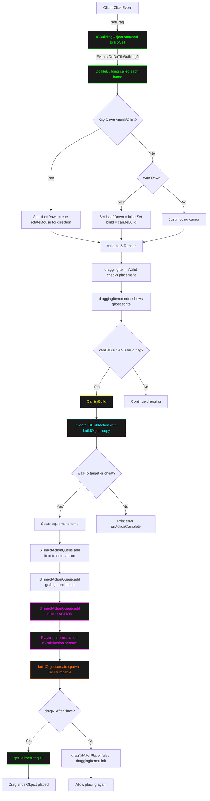

## Summary

**ISBuildingObject Server-Side Handling Flow:**

1. **setDrag Activation** (line 214): Building object attached to IsoCell when player initiates placement

2. **DoTileBuilding Loop** (lines 100-179): Called each frame via `Events.OnDoTileBuilding2`

   - Detects mouse clicks (Attack/Click key)
   - When released: sets `build = true` if valid placement
   - Validates position with `isValid()`
   - Renders ghost sprite preview

3. **tryBuild Trigger** (line 174): When `build=true` AND `canBeBuild=true`

   - Creates **ISBuildAction** early (line 203) with a copy of the building object
   - Validates walkable path via `walkTo()` (line 212)

4. **ISTimedActionQueue Chain** (lines 233-276):

   - **Line 233**: Transfer items if needed (two-hand items)
   - **Lines 251/259**: Grab ground items as materials
   - **Line 276**: Add main **ISBuildAction** to queue
   - Server executes actions sequentially

5. **World Instantiation**: ISBuildAction.perform() calls `buildObject:create()` → spawns IsoThumpable into world

6. **Cleanup** (lines 213-217):
   - If `dragNilAfterPlace=true`: calls `setDrag(nil)` to end drag immediately
   - If `false`: calls `reinit()` to allow placing same object again

The server uses `ISTimedActionQueue` to serialize the build process, ensuring equipment setup and material gathering happens before the actual build action executes.
