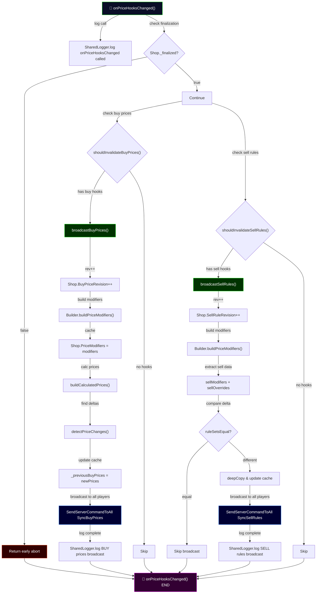

## Trace: `ShopFinalizeHandler.onPriceHooksChanged()`

**Purpose**: Handles runtime price hook changes by independently broadcasting buy price updates and sell rule updates to all players (after shop finalization is complete).

**Flow**:

1. **Validation Check** (L182-185)

   - Verifies `Shop._finalized` is true; aborts if shop not finalized yet

2. **Buy Prices Path** (L188-190)

   - `shouldInvalidateBuyPrices()` checks if any buy hooks exist
   - If yes, calls `broadcastBuyPrices()`:
     - Increments `Shop.BuyPriceRevision`
     - Builds price modifiers via `Builder.buildPriceModifiers()`
     - Calculates prices for enabled items
     - Detects changed prices (delta detection)
     - Broadcasts only changed prices via `SendServerCommandToAll("SyncBuyPrices")`

3. **Sell Rules Path** (L191-193)
   - `shouldInvalidateSellRules()` checks if any sell hooks exist
   - If yes, calls `broadcastSellRules()`:
     - Increments `Shop.SellRuleRevision`
     - Extracts sell modifiers & overrides from price modifiers
     - Compares with previous rules (delta detection)
     - Only broadcasts if rules changed
     - Broadcasts via `SendServerCommandToAll("SyncSellRules")`

**Key Features**:

- **Independent paths**: Buy and sell updates don't block each other
- **Delta detection**: Only broadcasts what actually changed
- **Guarded execution**: Only runs after shop is finalized
- **Server-wide sync**: All online players receive updates
