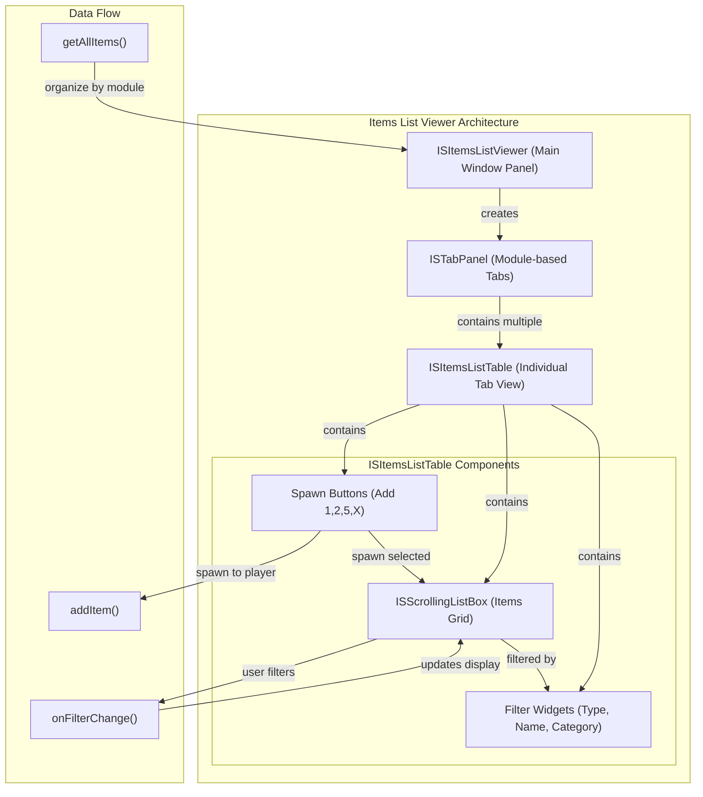

## Items List Viewer Implementation Summary

**Architecture:**

- **ISItemsListViewer** is the main container inheriting from ISPanel. It creates a tabbed interface where each tab represents a game module (Base, Farming, etc.)
- **ISItemsListTable** is used for each tab and contains the actual item display logic

**Core Components:**

1. **Data Loading** (`initList`, lines 41-86 in ISItemsListViewer)

   - Calls `getAllItems()` to fetch all game items
   - Groups items by module into tabs
   - Filters out obsolete/hidden items

2. **Display Grid** (ISItemsListTable, lines 66-86)

   - Uses `ISScrollingListBox` with 9 columns: Type, Name, Category, DisplayCategory, LootCategory, Craft, Forage, Loot, #spawn
   - Custom rendering via `drawDatas()` function (lines 474-572) showing item icons, names, and attribute colors

3. **Filtering System** (lines 127-238 in ISItemsListTable)

   - Text entry boxes for Type/Name (regex pattern matching)
   - Combo boxes for Category, DisplayCategory, LootCategory, and boolean flags (Craft/Forage/Loot)
   - `onFilterChange()` iterates all items and applies predicate functions to update display

4. **Item Spawning** (lines 241-286 in ISItemsListTable)
   - Four spawn buttons: Add 1, Add 2, Add 5, Add X (configurable quantity)
   - Double-clicking an item also triggers spawn
   - Uses `/additem` command on server or `instanceItem()` on single-player

**Key Functions:**

- `filterCategory/filterDisplayCategory/filterName()` etc. - Individual filter predicates
- `onFilterChange()` - Applies all active filters to rebuild the displayed list
- `addItem()` - Spawns selected item to chosen player inventory
