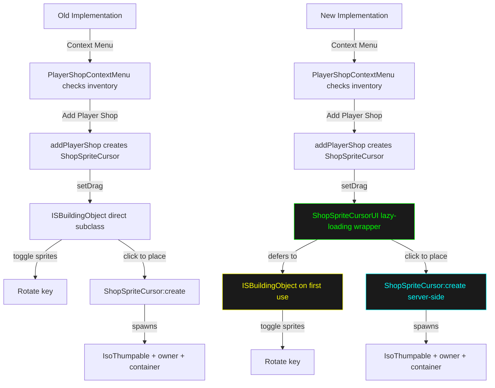

Key differences between old and new:



**1. Lazy-loading wrapper** (NEW)

```lua
-- OLD: Direct ISBuildingObject subclass
ShopSpriteCursor = ISBuildingObject:derive("ShopSpriteCursor")

-- NEW: Deferred initialization via ShopSpriteCursorUIBase
ShopSpriteCursor = ShopSpriteCursorUI:derive("ShopSpriteCursor")
  └─ ShopSpriteCursorUI is a lazy wrapper
     └─ Upgrades to ISBuildingObject on first client-side use
```

**2. File split** (NEW)

- `ShopSpriteCursorUI.lua` - Client-side UI wrapper (shared code, defers to ISBuildingObject)
- `ShopSpriteCursor.lua` - Server/SP-only creation logic (lines 1-4 check: `if isClient() and not isServer() then return end`)

**3. Error handling** (NEW)
More verbose logging and null checks:

```lua
-- NEW lines 51-54
if SHOPSB42.ShopSpriteCursor and SHOPSB42.ShopSpriteCursor.create then
    return SHOPSB42.ShopSpriteCursor:create(...)
end
SharedLogger.log("Shops", "[RealUI:create] ERROR: ShopSpriteCursor:create not available")
```

**4. Inventory removal** (SAME LOGIC, DIFFERENT FLOW)

- Now sends client command instead of direct removal (line 74):

```lua
sendClientCommand(self.character, "PS", "RemoveItemFromInventory", { itemID = playerShop:getID() })
```

**Result**: The new implementation is more robust with lazy-loading (handles ISBuildingObject availability gracefully) and proper client/server separation for multiplayer safety.
